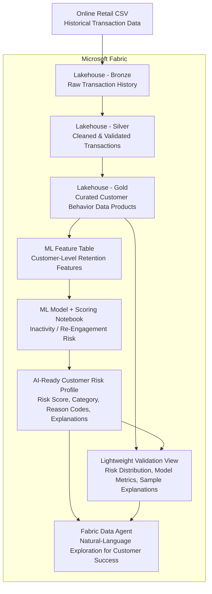

# Fabric AI Customer Retention Platform

A Microsoft Fabric AI + Data Engineering portfolio project that simulates a real-world customer retention proof of concept.

This project demonstrates how historical transaction data can be transformed into curated customer retention data products that support machine learning, explainable risk scoring, and a Fabric Data Agent experience for Customer Success users.

## Data Source

This project uses the **Online Retail** dataset from the UCI Machine Learning Repository.

The dataset contains transactional data from a UK-based online retail business and includes fields such as invoice number, product code, product description, quantity, invoice date, unit price, customer ID, and country.

Source: UCI Machine Learning Repository — Online Retail Dataset  
Dataset URL: https://archive.ics.uci.edu/dataset/352/online+retail

> Note: This dataset is used as a simulated customer transaction source for portfolio and educational purposes. The business scenario, customer success use case, retention-risk framing, ML workflow, and Fabric Data Agent experience are simulated for this project.

## Project Scenario

A customer-facing business wants to become more proactive in identifying customers who may be at risk of becoming inactive.

Today, Customer Success is mostly reactive. They may review historical reports or exported spreadsheets, but they do not have a consistent, explainable way to prioritize customers for re-engagement.

The business wants to explore whether historical transaction data can be used to identify customer behavior patterns that may indicate inactivity risk.

## POC Objective

Build a Microsoft Fabric-based proof of concept that:

- Ingests historical transaction data
- Cleans and standardizes the data
- Engineers customer-level retention features
- Trains and scores a baseline ML model
- Creates an explainable customer risk profile
- Grounds a Fabric Data Agent in curated risk data
- Supports natural-language exploration for Customer Success users

## Important Limitation

The available dataset does **not** include confirmed churn labels, subscription cancellation records, support tickets, satisfaction scores, product usage telemetry, or account-manager notes.

Because of this, the project does **not** position the model as a production churn prediction system.

Instead, the model estimates **inactivity risk** or **re-engagement priority** using transaction-derived customer behavior.

Preferred language:

- Inactivity risk
- Re-engagement priority
- Retention risk indicator
- Customer review priority

Avoided language:

- Guaranteed churn
- Confirmed churn prediction
- Customer will churn

## High-Level Architecture



## What This Project Demonstrates

This project is intentionally designed to show AI + Data Engineering capabilities beyond traditional BI dashboarding.

It demonstrates:

- Microsoft Fabric Lakehouse architecture
- Medallion data engineering pattern
- Data cleansing and standardization
- Customer-level feature engineering
- ML-based inactivity / re-engagement risk scoring
- Explainable AI outputs using reason codes
- AI-ready curated data product design
- Fabric Data Agent grounding strategy
- Lightweight validation reporting
- Senior-level scope control, assumptions, risks, and limitations

## Repository Structure

```text
fabric-ai-customer-retention-platform/
│
├── README.md
├── docs/
│   ├── 00_documentation_index.md
│   ├── 01_customer_scenario_and_requirements.md
│   ├── 02_poc_scope_and_success_criteria.md
│   └── 03_architecture_and_data_products.md
│
├── data/
│   └── README.md
│
├── notebooks/
│   ├── 01_ingest_bronze.ipynb
│   ├── 02_clean_silver.ipynb
│   ├── 03_feature_engineering.ipynb
│   ├── 04_train_score_model.ipynb
│   └── 05_create_ai_risk_profile.ipynb
│
├── agent/
│   ├── agent_instructions.md
│   └── validated_questions.md
│
├── validation/
│   └── README.md
│
└── src/
    └── README.md
```

## Documentation

Detailed planning and architecture documentation is available in the `/docs` folder.

| Document | Purpose |
|---|---|
| [`docs/01_customer_scenario_and_requirements.md`](docs/01_customer_scenario_and_requirements.md) | Simulated customer scenario, business problem, users, objectives, and requirements. |
| [`docs/02_poc_scope_and_success_criteria.md`](docs/02_poc_scope_and_success_criteria.md) | Two-week POC scope, deliverables, acceptance criteria, risks, assumptions, dependencies, and out-of-scope items. |
| [`docs/03_architecture_and_data_products.md`](docs/03_architecture_and_data_products.md) | High-level Fabric architecture, medallion layers, ML-ready features, AI-ready risk profile, and Data Agent grounding approach. |


## Project Status

Initial planning and scoping documentation is in-progress.

Implementation will follow a lightweight two-week POC approach is focusing on creating a demoable end-to-end retention intelligence workflow.
